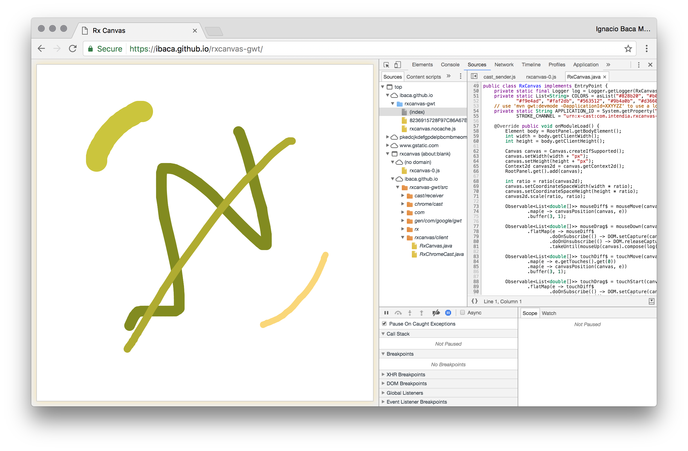

# GWT + RxJava + Canvas 

A super simple painter app (based on [RxPaint](https://github.com/headinthebox/RxPaint)) developed using 
[GWT](http://www.gwtproject.org/) (java to javascript framework), 
[RxJava](https://github.com/intendia-oss/rxjava-gwt) (event composition library) and 
[Canvas](https://developer.mozilla.org/en-US/docs/Web/API/Canvas_API) (draw graphics via scripting).

Run using `mvn gwt:devmode` and package using `mvn package`.

Deployed including `sourceMaps` and `source code`, so you can just enter [here](https://ibaca.github.io/rxcanvas-gwt/),
open your preferred developer tool an navigate through the `java` source code.

The app demonstrates how to combine UI, request and bus events uniformly using `Observables`. To
communicate to a remote device it uses `Chrome cast`, the app implements in the same entry point both
the sender and the receiver code, and bind the corresponding observable if available. If you want
to test the `Chrome cast` app locally you need to create your own application in the 
[Google Cast SDK Developer console](https://cast.google.com/publish/#/overview) and use your local
ip in the *Receiver application URL* (e.g. `http://192.168.1.100:8888/rxcanvas/receiver.html`). Once you
have your `Application ID` you can override it executing devmode with the `applicationId` param 
(e.g. `mvn gwt:devmode -DapplicationId=XXXYYYZZZ`) *TIP* You don't need to re-cast your app to reload 
code changes in the receiver side, just press `ctrl+r` in the developer console and GWT will trigger a 
recompilation automatically. This works in the sender-side/normal-web-side, but I spouse you already know that.
